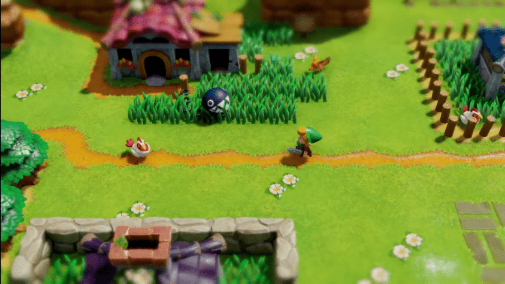

# Game Design Document Outline

## Title Page

   1. **Garbage Quest**

2. ## Game Overview

   1. **Game Concept**

   2. **Genre** :  Action aventure

   3. **Target Audience**

      * Dans l'idéal : tout le monde
      * En réalité: les adolescents et les jeunes adultes

      * Personnes sensible à l'Ecologie qui veulent en apprendre plus sur ce sujet la tout en s'amusant
      * Personnes sensible à l'Ecologie qui veulent sensibiliser leur entourage de manière ludique

   4. **Game Flow Summary** :

      Le joueur contrôle un personnage principal. Qui peut se déplacer dans 4 directions. Il peut intéragir  avec des NPC dans le monde. Il va se balader dans les donjons afin de faire d'arriver à son but et faire avancer l'histoire.

   5. **Look and Feel** : Style cell-shading => Zelda Wind Waker

3. ## Gameplay and Mechanics

   1. Gameplay

      1. **Game Progression** :

         ​	Le joueur débloque une mécanique dans un donjon afin de vaincre des nouveaux déchets qu'il n'avait jamais rencontré avant. Le joueur doit comprendre le dilemne lié à l'écologie.

         Plus le monde évolue en havre écologique =>

         * des gens quittent la ville => maisons en ruine/abandonnées
         * les agriculteurs sont en difficulté
         * des gens sont au chomage

A contrario :

* l'agriculture repart et est plus saine
         * les gens se sentent mieux car il y a moins de pollution => heureux
         * Les aliments sont meilleurs

2. **Mission/challenge Structure**

   Plusieurs donjon pour arriver à la fin du jeu

   Boss à la fin des donjons

3. **Puzzle Structure**

4. **Objectives** :

   Rendre le monde moins pollué en le nettoyant étape par étape (cf: Donjon)

5. **Play Flow** :

   Le joueur débute avec des mécaniques simples (exemple: juste poser un déchet dans une poubelle). Plus l'histoire avance plus le joueur débloque des élements de gameplay (exemple: compacter, mettre au composte, trier ses dechets, ...)

2. Mechanics

   1. **Physics** : Il y a un système de lancer d'objet, les ennemis sont projetés après avoir pris un coup
      2. **Movement in the game** :
         * mouvement simple quadri-directionnel + diagonales
         * rotation du personnage
      3. **Objects** : pour rammasser un objet le joueur doit s'approcher de cet objet et doit appuyer sur un bouton E.
      4. **Actions** :
         * rammasser des déchets
         * attaquer un mob (déchets vivants)
         * vider ses poubelles
         * lancer des ennemis
      5. **Combat** le joueur possède plusieurs armes, plus ou moins efficace selon le type de déchets (ennemis), lancer des objets (exemple: déchets, rocher)
      6. **Economy**
      7. **Screen Flow** : la caméra suit le personnage en vue du dessus. Elle se bloque sur les coins de la map. Les donjons nécessite un chargement du coup un changement d'écran.

3. **Game Options** :

   Difficulté (Easy, medium, hard, no save mod) : affecte le nombre de point de vie des ennemis et les dégats que le joueur encaisse.

4. **Replaying and Saving** :

   Le joueur peut sauvegarder à tout moment mais au chargement du jeu, le personnage commencera à la dernière porte (chargement) passée.

4. ## Story, Settings and Character

   1. **Story and Narrative** :

      ​	L'histoire se déroule dans un petit village "PeaceTown".

      **Intro**:

      Le personnage se reveille dans sa maison. Il lit un message (SMS ?) laissé par sa mère lui disant d'aller chez son grand-père.

      (**Training Level**) Il va donc sortir et se diriger vers chez son grand père. Pour cela, il va traverser le village dans lequel il y a **énormement** de déchets et avec un air très pollué. Arrivé chez son grand père, il va discuter avec lui et se rendre compte que son grand père ne va pas bien du tout. Il tousse, a du mal à respirer et trouve que sa nourriture a un drôle de goût.

      Quand le PP (personnage principal) sort de la maison, il va entendre une voix.

      * Tu as remarqué à quel point ton grand-père est malade?
      * Hein!? Qui es-tu ? demande le PP

      * "Je suis la nature!" lui répond un petit être vert

      * Comment est-ce possible?

      * Je me suis incarné en cet être car l'heure est grave et je devais agir. Mais ce n'est pas important. Tu as vu que ton grand père souffrait à cause de cette pollution dans ton village?

   * Oui j'ai remarqué mais il n'est plus tout jeune c'est normal.

   (le PP avance jusqu'au village, quand il y arrive)

   * Ce n'est pas le seul regarde les habitants du village! Tu ne trouves pas qu'il y a des problèmes!? Si vous ne faites rien ton grand père va mourrir et les gens du village vont tomber gravement malade aussi.

      * Mais qu'est ce que je peux faire pour arrêter ça?

   * Rend toi à la centrale de charbon.

   "Transition (fondu au noir) pour se retrouver devant la centrale"

   * Regarde ce nuage de fumé. C'est ce qui rend tout le monde malade. Cette fumé rend les dechets vivant !

   ("cinématique" : les dechets prennent vie)

   * Tu as raison je dois arrêter ça!

      Phase de gameplay :

      Tutoriel du combat

   **Dilemne** :

   ​	**Themes généraux** :

   * Economique
      * Touristique

   1. Fermeture de la centrale à charbon :

      **positif** :

      * l'air est moins pollué
        * les gens vont mieux

      **negatif** :

      * pleins de gens se retrouve au chomâge
      * moins d'électricité
        * installation de panneaux solaires qui attire moins de gens pour le tourisme

   2. Le tri selectif

      **Avant** : Il y a une énormes décharges qui pollue la terre et l'eau du lac

      ​	=> les gens sont malades à cause des aliments

      **positif** :

      * la décharge a beaucoup diminuée de volume
      * des poubelles de tri sont apparues
      * crée des emplois

      **negatif** :

      * centrale de tri
      * Argent public utilisé pour le tri (augmentation des taxes)

   3. Suppression des pesticides

      **positif** :

      * les aliments sont de meilleurs qualité
      * l'eau est meilleure pour la santé
      * moins de nourriture est importé
      * les gens sont plus gentil

      **negatif** :

      * moins de production de fruits et légumes
      * les produits de traitement sont plus cher => les produits sont plus cher

   1. **Game World** :

      Il y  a un village qui est central dans le monde. Il y a plusieurs donjons correspondant aux différentes zones du jeu => problèmatique de l'écologie.

   2. **Characters** :

      **Personnage principal** : il parle aux habitants, il est plutot jeune et insouciant.

      **NPC** : Il y a un medecin, un maire, un fermier (possède un bac à composte), un réparateur, une école.

      Des animaux dans la ville.

5. ## Levels

   1. **Levels** :

      * Le monde évolue à chaque fois qu'un donjon est terminé par le joueur. Exemple (après le premier donjon, des poubelles de tri apparaissent dans le village)

      * Premier donjon : lier au tri séléctif. Le personnage apprend à trier ses déchets, il possède 2 poubelles (sur lui, lié à son inventaire avec un nombre limité de place) à ce moment la du jeu. Il doit relancer l'usine de recyclage des déchets. Le donjon est composé principalement de déchets en carton, papier, boite de conserve, aluminium, verre, ...
      * Deuxième donjon : Arrêter le traitement des terres avec des pesticides chimiques. Donjon composé principalement de plantes que l'on peut battre qu'en les traitants avec des pesticides bio.
      * Troisième donjon: le joueur doit enlever le plastique présent dans l'eau

   2. **Training Level** : Le grand père vous donne comme mission de nettoyer sa maison.Le grand père vous donne comme mission de nettoyer sa maison.

      Le grand père vous donne comme mission de nettoyer sa maison.

6. ## Interface

   1. **Visual System** :

      * la vie du personnage représentée avec des pommes
      * le taux de remplissement des sacs personels
      * l'objet tenu en main par le personnage
      * Inventaire :
        * le taux de remplissement des sacs personels
        * la liste des outils que le joueur possède
        * Carte du monde (mise à jour selon les zones explorées)

   2. **Control System** :

      * Boutons de déplacement (ZQSD, Stick manette)
      * Bouton USE (E, X sur manette)
      * Bouton USE Outil (Souris ou  flèche directionnel, stick analogique)
      * Bouton Roulade (ESPACE, A sur Manette)
      * Bouton Pause (Echap, start sur Manette)
      * Bouton inventaire (TAB, Select sur Manette)

   3. **Audio, music, sound effect** :

      Music : style retro

      * assez rapide en combat  (évolutive).
      * assez calme en temps normal
      * musique très calme dans le village
      * Une musique par donjon

   4. **Help System** :

      L'aide est matérialisée par un petit être vert qui incarne la nature. Qui nous donne des conseils pour la suite des évenements.

7. ## Artificial Intelligence

   1. Opponent and Enemy AI

   2. Non-combat and Friendly Characters

   3. Support AI

8. ## Technical

   1. **Target Hardware** :

      PC,

   2. **Development hardware and software, including Game Engine** :

      Unity Engine

   3. **Network requirements** :

      Internet n'est pas nécessaire pour jouer

9. ## Game Art

   
